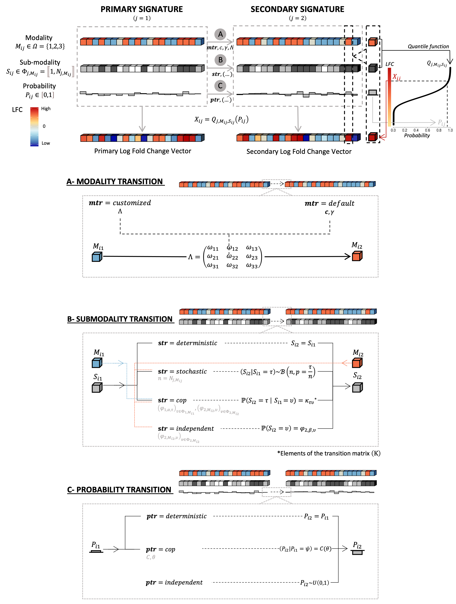

# README

## Introduction

Cosimu is an R package implemented to simulate pairs of interconnected differential expression signatures. The statistical framework it is based on allows for ajustable levels of parametrization. 

A pair of interconnected differential expression signatures consists of two types of signatures: the primary and the secondary signature. In our model, each signature is decomposed in tree layers :

1) **Modality layer**: this layer categorizes the genes into three deregulation statuses (modalities) up-regulated, down-regulated and non deregulated.
2) **Sub-modality layer**: this layer represents the amplitude of the deregulation, modeled with a probability density distribution – specifically, the associated quantile functions.
3) **Probability layer**: this layer is used to draw a log fold-change (LFC) value from the linked probability distribution function. 

# Installation
```
install.packages("devtools")
devtools::install_github("https://github.com/cgonzalez-gomez/cosimu.git")
```

# Simulation Process
Initially, the quantile function associated with each gene is determined based on its modality category and the sub-modality rank. Subsequently, the LFC value of the gene is calculated as the image of the probability value by the quantile function. It is important to note that this process remains consistent whether simulating the primary or the secondary signature. The three layer simulation process are wrapped in the signature objects : `PrimarySignatureObj` and `SecondarySingatureObj`. A simple example can be found on https://github.com/cgonzalez-gomez/cosimu_application.git .


## Primary Signature (`PrimarySignatureObj`)
First, it is necessary to simulate the primary signature by calling `cosimu::PrimarySignatureObj$new`. Based on the set of input parameters, the three layers of the signature are generated by sampling.

## Secondary Signature (`SecondarySignatureObj`)
Second, the primary signature is used as input to generate the secondary one (`cosimu::SecondarySignatureObj$new`). In fact, the layers of the secondary signatures are obtained based on the primary ones and the type of link between them is given as an input parameter. Transition parameters have different impacts on the type of relation between the signatures, as detailed on the paper ***Optimizing in silico drug discovery: simulation of connected differential expression signatures and applications to benchmarking***. One of those parameters is the connectivity score between the pair of signatures, it defines the transition matrix between the two modality layers.

## Including real data during the simulation 

Parameters of the simulation, notably the sub-modalities distributions, can be inferred from real data.The function `infer_dist` simplifies this taj by taking a LFC vector along with other parameters, and inferring the different submodalities that charactize the distribution, as detailed in the paper. 

On the other hand, `cosimu` allows to simulate the control expression levels of genes, based on real data. The input expression vector, is then adjust according to the values of the simulated signature, to generate a realistic control level. On realdata: down-regulated genes were more likely to be expressed or highly expressed in the reference condition, and inversely for up-regulated genes.

## Read counts simulation
Finally,`cosimu` includes an option to simulate read counts from a fold-change vector thanks to the `read_counts_gen` function. This feature wasinspired by the negative binomial model used in `polyester`.
